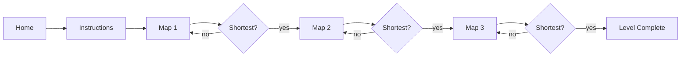

# 🚀 Missile Simulation

> **Dijkstra's algorithm, but turned into a tiny mission game.**

A 2022 Java Swing project where the player has to route a missile through a weighted graph and reach the target using the **shortest possible path**.

This is not a physics or real-world weapons simulator. The missile theme is just the game wrapper around a graph-algorithm exercise: pick a route, launch, and let Dijkstra decide whether the route was optimal.

<p align="center">
  
</p>

`Java 8` · `Swing` · `Dijkstra's algorithm` · `weighted graphs` · `NetBeans / Ant`

---

## the idea

I wanted to make a shortest-path assignment feel less like printing numbers into a terminal.

So the graph became a mission map.

The player starts at node **A**, chooses connected nodes using the controls below the map, and builds a route toward the final node. Every move adds that edge's weight to the route total. When **LAUNCH** is pressed, the app runs Dijkstra's algorithm from the start node and compares the optimal distance with the route the player chose.

```text
player chooses a route
        │
        ▼
edge weights accumulate
        │
        ▼
       LAUNCH
        │
        ▼
Dijkstra calculates the shortest distance
        │
        ├── same distance ──► mission complete
        │
        └── different ─────► mission failed / retry
```

There are three levels, with each graph getting a little larger.

## the maps

<table>
  <tr>
    <td align="center"><strong>Map 1 · A → D</strong></td>
    <td align="center"><strong>Map 2 · A → E</strong></td>
    <td align="center"><strong>Map 3 · A → F</strong></td>
  </tr>
  <tr>
    <td></td>
    <td></td>
    <td></td>
  </tr>
</table>

| Level | Nodes | Target | Shortest distance | Winning route |
| --- | ---: | --- | ---: | --- |
| Map 1 | 4 | D | `10` | `A → B → C → D` |
| Map 2 | 5 | E | `13` | `A → B → E` |
| Map 3 | 6 | F | `15` | `A → B → F` |

Those values come directly from the adjacency matrices used by the application.

## how a level works

Each map has two pieces of logic running side-by-side.

The **player path** is handled by the Swing button events. Clicking a valid next node increments `distancecount` by that edge's weight and enables the next legal choices.

The **reference answer** is calculated when the player launches. The map builds an adjacency matrix, runs a simple array-based implementation of Dijkstra's algorithm, and reads the shortest distance from node `A` to the level's final node.

The level succeeds when:

```java
shortestDistance == distancecount
```

That makes the game less about selecting a specific memorized sequence and more about matching the optimal route cost.

## graph data

### Map 1

```text
    A  B  C  D
A   0  3  6  0
B   3  0  2  8
C   6  2  0  5
D   0  8  5  0
```

Shortest route: `A → B → C → D = 3 + 2 + 5 = 10`

### Map 2

```text
    A  B  C  D  E
A   0  7  5  0  0
B   7  0  3  4  6
C   5  3  0  4  0
D   0  4  4  0  6
E   0  6  0  6  0
```

Shortest route: `A → B → E = 7 + 6 = 13`

### Map 3

```text
    A   B   C   D   E   F
A   0  10  15   0   0   0
B  10   0   0  12   0   5
C  15   0   0   0  10   0
D   0  12   0   0   2   5
E   0   0  10   2   0   5
F   0   5   0   5   5   0
```

Shortest route: `A → B → F = 10 + 5 = 15`

## Dijkstra in this project

The implementation is deliberately simple and matches the scale of the three hard-coded maps.

For every level it:

1. converts `0` entries into a large sentinel value (`999`) to represent missing edges;
2. starts from node `A`;
3. keeps an array of tentative distances;
4. repeatedly chooses the unvisited node with the smallest known distance;
5. relaxes its outgoing edges;
6. compares the target distance with the player's accumulated route distance.

It uses arrays rather than a priority queue, so the implementation is roughly **O(V²)**. With at most six vertices, that is more than enough for the game.

The deeper breakdown—including the shortcuts, limitations and what I would refactor today—is in [`docs/engineering.md`](docs/engineering.md).

## game flow



A small bug in the original project made **Retry** restart from Map 1 even if the player failed Map 2 or Map 3. The current version now retries the level that actually failed.

## project structure

```text
missile-simulation/
├── src/pdsa_cw2_t1/
│   ├── PDSA_CW2_T1.java   # entry point
│   ├── Home.java           # main menu
│   ├── Instruction.java    # game instructions
│   ├── Map1.java           # 4-node graph
│   ├── Map2.java           # 5-node graph
│   ├── Map3.java           # 6-node graph
│   ├── MBox1.java          # success / level progression
│   ├── MBoxFail.java       # failure / retry flow
│   ├── Last_Page.java      # campaign-complete screen
│   ├── *.form              # NetBeans Swing form metadata
│   └── *.png               # UI and graph artwork
├── nbproject/              # NetBeans project configuration
├── lib/                    # NetBeans CopyLibs support
├── build.xml               # Ant build entry point
├── manifest.mf
└── README.md
```

Generated `build/`, packaged `dist/`, and machine-local `nbproject/private/` files were removed from source control during the repository cleanup.

## running it

The project targets **Java 8** and uses the NetBeans Ant project structure.

### from the command line

```bash
git clone https://github.com/SenithUmesha/missile-simulation.git
cd missile-simulation

ant clean jar
java -jar dist/PDSA_CW2_T1.jar
```

### with NetBeans

Open the repository as an existing NetBeans Java project and run `PDSA_CW2_T1`.

The first screen launches `Home`, then the app moves through instructions and all three maps.

## what this project taught me

This is one of those repositories I would not architect the same way today—and that is exactly why I like keeping it around.

It was an early hands-on exercise in:

- representing weighted graphs as adjacency matrices;
- implementing Dijkstra without hiding behind a library;
- translating an algorithm into interactive game rules;
- keeping UI state and graph traversal state in sync;
- building a multi-screen desktop flow in Swing;
- packaging a Java desktop project with NetBeans and Ant.

It also shows a few classic early-project decisions: duplicated algorithm code between levels, static screen state, route weights repeated outside the graph matrix, GUI-builder-generated classes, and a lot of behavior living directly inside event handlers.

The repository now documents those trade-offs instead of pretending they are modern architecture.

## if I rebuilt it today

The first changes would be structural rather than visual:

```text
LevelDefinition
├── graph
├── startNode
└── targetNode

ShortestPathSolver
└── dijkstra(level.graph)

RouteSession
├── selectedNodes
├── distance
└── availableMoves

GameScreen
└── renders any LevelDefinition
```

That would remove the three mostly duplicated map classes, make the graph the single source of truth for edge weights, let the solver return the actual shortest path as well as its distance, and make the algorithm easy to unit-test independently from Swing.

For a 2022 coursework side quest, though, the fun part was getting from **graph theory → buttons → launch → mission complete**.

---

built in Java, powered by Dijkstra, wrapped in a slightly dramatic red **LAUNCH** button.
